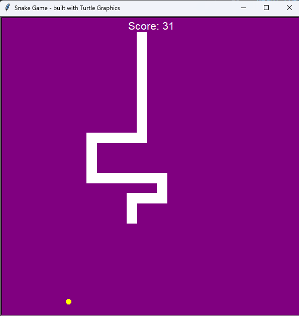
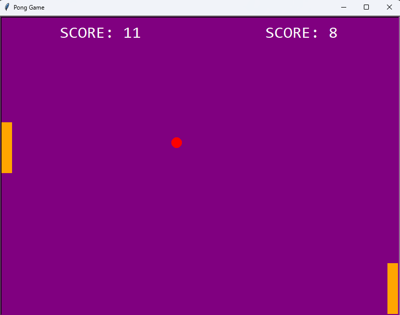

***TUTORIALS***
- Build the project with Python version > 3.8
- Go to the folder of the project you want -> Type the command: python main.py

***CURRENT PROJECTS***

1. Snake Game

2. Pong Game

3. Turtle passing
